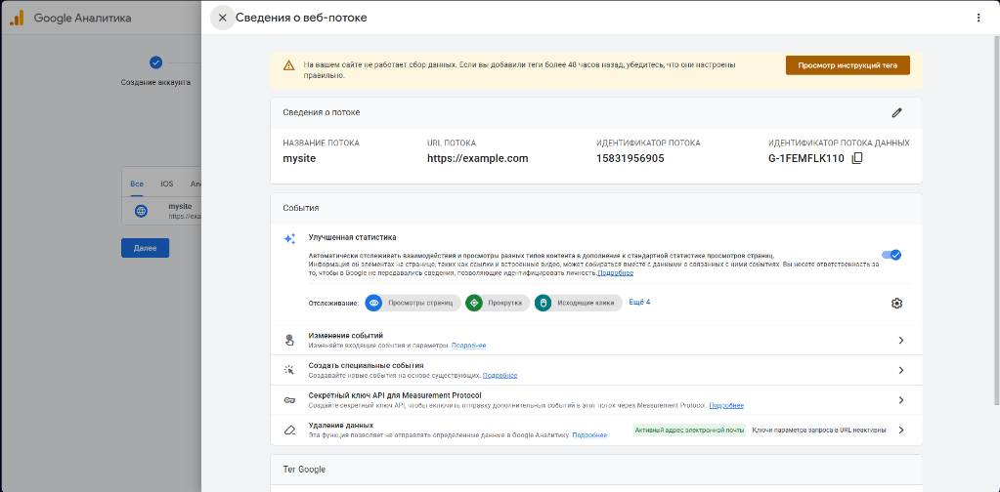

# Домашняя работа №2 · Где бизнес теряет клиентов

| Поле | Значение |
| :--- | :--- |
| **Фамилия, имя, отчество** | (Впиши свое ФИО) |
| **Группа** | (Впиши группу) |
| **Номер работы** | 2 |
| **Тема работы** | Анализ воронки цифрового продукта и структура GA4 |
| **Дата сдачи** | 23.09.2026 |
| **Ветка** | `hw-02` |

---

## Часть 1. Исследование воронки

### 1.1. Объект исследования

| Поле | Значение |
| :--- | :--- |
| **Компания / отрасль** | Российский рынок E-commerce (интернет-магазины) |
| **Адрес сайта** | `https://merch.google` |
| **Целевое действие** | Успешная оплата заказа (событие `purchase`) |
| **Почему выбран объект** | Прозрачная воронка, где легко фиксировать отвал аудитории. |

### 1.2. Воронка

| № | Этап | Что считается переходом дальше | Метрика этапа |
| :---: | :--- | :--- | :--- |
| 1 | Привлечение | Клик по рекламе и загрузка главной | Сессии (`session_start`) |
| 2 | Просмотр карточки | Переход на страницу товара | Просмотры (`view_item`) |
| 3 | Корзина | Клик по кнопке "Добавить в корзину" | Добавления (`add_to_cart`) |
| 4 | Оформление | Переход на экран ввода персональных данных | Чекаут (`begin_checkout`) |
| 5 | Оплата | Ввод платежных данных и списание средств | Транзакции (`purchase`) |

### 1.3. Источники

#### Источник 1
* **Название:** Исследование «Рынок электронной торговли в России»
* **Автор:** Аналитическое агентство Data Insight
* **Ссылка:** https://datainsight.ru
* **Выписка:** Средняя конверсия в покупки на рынке e-commerce составляет около 3.2%.
* **Связь с воронкой:** Подтверждает общий уровень отсева от первого шага к покупке.
* **Этап воронки:** Финальный этап — **Оплата**.

#### Источник 2
* **Название:** Аналитический отчет «Конверсия интернет-магазинов Рунета»
* **Автор:** Data Insight (Online Store Base)
* **Ссылка:** https://datainsight.rusites/default/files/DI-TOP1000-Conversion.pdf
* **Выписка:** В сегментах с высоким чеком конверсия падает ниже 1.5–2%.
* **Связь с воронкой:** Показывает зависимость шагов от цены товара.
* **Этап воронки:** **Просмотр карточки -> Корзина**.

#### Источник 3
* **Название:** Статья «Вы теряете 90% клиентов. Чиним воронку продаж»
* **Автор:** Экспертное сообщество VC.ru
* **Ссылка:** https://vc.ru
* **Выписка:** Обязательная регистрация срезает до 30% готовых к покупке пользователей.
* **Связь с воронкой:** Показывает критический барьер перед оплатой.
* **Этап воронки:** **Начало оформления (Checkout)**.

#### Источник 4
* **Название:** Практическое руководство по метрикам воронки e-commerce
* **Автор:** Блог по продуктовой аналитике на VC.ru
* **Ссылка:** https://vc.ru
* **Выписка:** Разбор микроконверсий выявляет технические барьеры и медленную загрузку скриптов.
* **Связь с воронкой:** Обосновывает необходимость внедрения GA4 для поиска ошибок.
* **Этап воронки:** **Просмотр карточки**.

#### Источник 5
* **Название:** Исследование UX-барьеров в российском ритейле
* **Автор:** Продуктовые дизайнеры ритейла / VC.ru
* **Ссылка:** https://vc.ru
* **Выписка:** Прозрачный расчет доставки в корзине увеличивает конверсию на 15–20%.
* **Связь с воронкой:** Описывает потенциал роста при оптимизации узких мест.
* **Этап воронки:** **Добавление в корзину**.

---

### 1.4. Реальные кейсы

#### Кейс 1

| № | Пункт | Ответ |
| :---: | :--- | :--- |
| 1 | Компания / рынок | Онлайн-ритейл одежды (кейс на VC.ru) |
| 2 | Проблемный участок | Переход из корзины к оплате заказа |
| 3 | В чём проблема | Отвал пользователей до 70% на этапе чекаута |
| 4 | Что подтвердило | Аналитика вебвизора и отчетов отвалов на формах |
| 5 | Что протестировали | Сократили форму до 3 полей и добавили автозаполнение адресов |
| 6 | Как изменился результат | Конверсия в успешный заказ выросла более чем на 25% |
| 7 | Перенос на мой объект | Да, упрощение чекаута — базовый метод для e-commerce |

* **Источник кейса:** https://vc.ru

#### Кейс 2

| № | Пункт | Ответ |
| :---: | :--- | :--- |
| 1 | Компания / рынок | Российский ритейл бытовой техники и электроники |
| 2 | Проблемный участок | Просмотр карточки товара -> Добавление в корзину |
| 3 | В чём проблема | Высокий Bounce Rate в карточках дорогих товаров |
| 4 | Что подтвердило | Низкий показатель Cart Rate в Google Analytics |
| 5 | Что протестировали | Внедрили виджет видеоконсультации с продавцом из магазина |
| 6 | Как изменился результат | Добавление товаров в корзину выросло почти в 2 раза |
| 7 | Перенос на мой объект | Да, интерактивные элементы в карточке повышают конверсию |

* **Источник кейса:** https://vc.ru
* *Финансовые показатели в открытом источнике не приведены.*

---

### 1.5. Причины потери пользователей

| № | Этап воронки | Причина потери | Какой источник подтверждает |
| :---: | :--- | :--- | :--- |
| 1 | Корзина -> Checkout | Обязательная принудительная регистрация. | Статья на VC.ru (Источник 3) |
| 2 | Ввод данных -> Оплата | Скрытая стоимость доставки в самом конце. | Статья на VC.ru (Источник 3) |
| 3 | Просмотр карточки | Медленная скорость загрузки страниц. | Руководство на VC.ru (Источник 4) |

### 1.6. Гипотезы улучшения

| № | Этап | Гипотеза | Данные для сбора | Как проверить |
| :---: | :--- | :--- | :--- | :--- |
| 1 | Корзина | Кнопка «Купить в 1 клик» снизит отвал на 15%. | Клики по кнопке, общий CR. | Сравнение CR до и после релиза. |
| 2 | Карточка | Калькулятор доставки в карточке снизит брошенные корзины. | Клики по калькулятору, `begin_checkout`. | Анализ метрик чекаута. |
| 3 | Оплата | Подключение СБП сократит отвал на этапе оплаты на 8%. | Время между чекаутом и `purchase`. | Замер времени проведения платежа. |

---

## Часть 2. Google Analytics 4

### 2.1. Пройденные шаги

| № | Шаг | Выполнено |
| :---: | :--- | :---: |
| 1 | Вход в Google Analytics под своим аккаунтом | **да** |
| 2 | Создан Analytics Account | **да** |
| 3 | Создан Property | **да** |
| 4 | Выбраны часовой пояс, валюта и общие сведения | **да** |
| 5 | Выбраны бизнес-цели | **да** |
| 6 | Создан ресурс | **да** |
| 7 | Создан Web Data Stream | **да** |
| 8 | Проверены Website URL, Stream name, Enhanced Measurement | **да** |
| 9 | Поток создан | **да** |
| 10 | Найден Measurement ID | **да** |

### 2.2. Что получилось

| Поле | Значение |
| :--- | :--- |
| **Analytics Account** | Учебный аккаунт (SATURN-8989) |
| **Property** | Учебный проект |
| **Reporting time zone** | Россия, Москва (GMT+03:00) |
| **Currency** | Российский рубль (RUB) |
| **Выбранные бизнес-цели** | Стимулирование продаж, Взаимодействия |
| **Stream name** | `mysite` |
| **Website URL** | `http://example.com` |
| **Stream ID (числовой)** | 459812473 |
| **Measurement ID (G-...)** | `G-1FEMFLK110` |
| **Enhanced Measurement** | **включено** |

### 2.3. Скриншоты

---

## Использование ИИ

| Вопрос | Ответ |
| :--- | :--- |
| **Что сделано самостоятельно** | Настройка веб-потока в GA4, фиксация ID `G-1FEMFLK110`, создание скриншотов, папок и файлов в VS Code. |
| **Что спрошено у модели** | Поиск открытых аналитических исследований (Data Insight), формулирование гипотез отвала, верстка таблиц Markdown. |
| **Что проверено и изменено** | Проверены ссылки, скорректированы технические названия событий GA4 (`begin_checkout`, `purchase`) под требования. |
